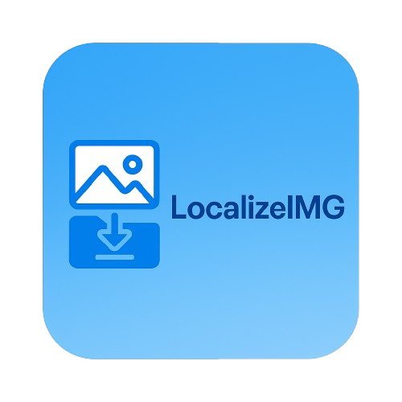

<p align="center">
  
</p>

  

🚀 **Download and localize remote image URLs in your HTML files with a single click!**

---

## ✨ What is LocalizeIMG?

🌐 **LocalizeIMG** is a powerful VS Code extension that automatically downloads all remote images in your HTML files and replaces the URLs with local file paths. This makes your web projects more portable, reduces external dependencies, and improves load times when developing locally.

---

## ⚙️ **Features**
- ✅ **One-Click Download** – Download all remote images from an HTML file with a single command.  
- 📁 **Smart File Naming** – Creates unique filenames based on the image URL to prevent duplicates.  
- 🔍 **Content-Type Detection** – Automatically identifies the correct file extension based on the image content.  
- 🔄 **Path Updating** – Seamlessly updates your HTML with the correct relative paths to the local images.  
- 📊 **Progress Reporting** – Shows download progress and results in the VS Code interface.  

---

## 🎯 **Why Use LocalizeIMG?**
- 🚫 **Portability** – Make your projects fully portable without external dependencies.  
- 🔌 **Offline Development** – Continue development without internet access.  
- ⚡ **Performance** – Speed up page loads during development.  
- 📦 **Asset Management** – Keep all your project assets in one place.  
- 🔗 **Broken Link Prevention** – Avoid broken images if remote sources change or go down.  

---

## 🔽 **Installation**
You can install this extension directly from the VS Code Marketplace:

1️⃣ Open VS Code  
2️⃣ Go to Extensions (Ctrl+Shift+X)  
3️⃣ Search for **"LocalizeIMG"**  
4️⃣ Click **"Install"**  

Alternatively, download the VSIX file from the [🔗 releases page](https://github.com/VihangaDev/LocalizeIMG/releases) and install it manually through VS Code.

---

## 🚀 **Usage**
1️⃣ Open an HTML file containing remote image URLs (`http://` or `https://`).  
2️⃣ Run the command by either:  
   - Opening the Command Palette (Ctrl+Shift+P) and typing **"LocalizeIMG: Download Remote Images"**  
   - Right-clicking in the editor and selecting **"LocalizeIMG: Download Remote Images"** from the context menu  

**The extension will:**  
1. 📂 Create an `images` folder in your workspace if it doesn't exist.  
2. ⬇️ Download all remote images and save them to this folder.  
3. 🔄 Update your HTML with the correct relative paths to these local images.  
4. ✅ Show a success message with the number of images localized.  

---

## 💡 **Example**

**Before:**  
```html


```

**After:**  
```html


```

---

## 🛠️ **Requirements**
- VS Code **1.80.0** or higher  
- Internet connection (for downloading the remote images)  

---

## ⚙️ **Extension Settings**
No configuration required. Plug and play! 🎉  

---

## 🐞 **Known Issues**
Please report any issues on the [GitHub repository](https://github.com/VihangaDev/LocalizeIMG/issues).  

---

## 🚀 **Future Features**
- 📌 Option to specify custom download location  
- 🎨 Support for CSS background images  
- 📁 Batch processing of multiple HTML files  
- ⚡ Image optimization during download  

---

## 📄 **License**
This extension is licensed under the [MIT License](LICENSE.txt).  

---

## 👨‍💻 **About the Author**
Created by [VihangaDev](https://github.com/VihangaDev) to simplify web development workflows.  

---

**Enjoy coding with LocalizeIMG!** 💻✨
